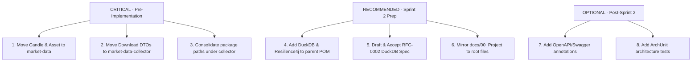

# Comprehensive Final Architecture Review: Research Platform

**Role:** Principal Software Architect  
**Date:** August 2026  
**Repository:** `research-platform`  
**Target Review:** Overall Modular Monolith Architecture, Domain Boundaries, Module Isolation, DDD Alignment, and Scalability  
**Review Status:** Final Architecture Review Complete  

---

## Executive Summary

As Principal Software Architect, I have conducted an exhaustive, top-to-bottom architectural review of the **Research Platform** repository (`0.1.0-SNAPSHOT`). 

The platform is designed as a Java 21 / Spring Boot 3.5.x **Modular Monolith** intended to serve as a generic, enterprise-grade quantitative research framework. It is strictly instrument-agnostic (designed for Crypto, Stocks, Forex, Commodities, and Indices) and exchange-agnostic.

Overall, the foundational vision, single-direction data flow, interface-driven design, and technical stack (Java 21 Records, Spring Boot 3.5.x, DuckDB OLAP) are outstanding. However, **critical domain boundary violations** exist in the current preliminary code state:
1. Core domain entities (`Candle`, `Asset`) and ingestion DTOs (`DownloadRequest`, `DownloadResult`) currently reside inside `common`, creating a **"God Common" anti-pattern** that violates Domain-Driven Design (DDD).
2. Package collisions exist in `market-data-collector` (`marketdatacollector.provider` vs `collector.provider`).
3. Essential infrastructure libraries (DuckDB JDBC, Resilience4j) are unmanaged in `pom.xml`.
4. `RFC-0002` (DuckDB Persistence) is unwritten despite being required for Phase 5 of data ingestion.

This review provides a formal architectural evaluation, answers all specific design questions, details recommended changes by priority, and renders a formal **Architecture Freeze Decision**.

---

## Architecture Score: 8.2 / 10

| Architectural Dimension | Score | Assessment |
| :--- | :---: | :--- |
| **System Style & Topology** | **9.5/10** | Modular monolith with clean Maven module isolation; ideal for fast execution and future microservice extraction. |
| **Data Flow & Pipeline** | **9.5/10** | Predictable, linear forward pipeline (`Collector -> Validation -> Normalization -> Persistence -> Indicators -> Patterns -> Strategy -> Backtest -> Analytics`). |
| **Domain-Driven Design (DDD)** | **6.0/10** | **Weakness:** Domain entities (`Candle`, `Asset`) and API DTOs are misplaced in `common` instead of `market-data` and `market-data-collector`. |
| **Package Organization** | **6.5/10** | **Weakness:** Dual package structure in `market-data-collector` (`marketdatacollector` vs `collector`) creates collision risk. |
| **Extensibility (Open/Closed)** | **9.0/10** | Interface-driven provider abstractions (`MarketDataProvider`) allow adding new exchanges or asset classes seamlessly. |
| **Technology Stack** | **9.0/10** | Modern Java 21 LTS (Records, Pattern Matching), Spring Boot 3.5.0, DuckDB OLAP engine, JUnit 5. |
| **Documentation Health** | **7.5/10** | `docs/00_Project/ProjectGuide.md` and `RFC-0001` are exemplary; root meta-files and `RFC-0002` are empty placeholders. |

---

## Architectural Strengths

1. **Enterprise Modular Monolith Design:** Avoids premature microservices complexity while maintaining rigid compile-time module isolation.
2. **Asset & Exchange Agnosticism:** The architecture successfully decouples asset symbols and exchange mechanics from core domain logic. Bitcoin is correctly treated as a sample data asset, not a built-in assumption.
3. **Interface-Driven Decoupling:** Business services depend exclusively on interfaces (`MarketDataProvider`, `CandleRepositoryPort`) using Constructor Injection. No field injection or static singletons.
4. **Immutability & Java 21 Idioms:** Uses Java 21 Records for DTOs and value objects, guaranteeing thread safety and data integrity across thread boundaries.
5. **Linear Unidirectional Data Pipeline:** Prevents circular logic and spaghetti flows by ensuring data flows exclusively forward from ingestion to analytics.

---

## Architectural Weaknesses & Anti-Patterns

1. **"God Common" Anti-Pattern (DDD Violation):**
   * Placing `Candle`, `Asset`, `DownloadRequest`, and `DownloadResult` inside `common` forces `common` to own financial market domain logic. `common` becomes a dumping ground, violating Domain-Driven Design.
2. **Package Hierarchy Fragmentation:**
   * `market-data-collector` contains two active package trees: `com.guru.researchplatform.marketdatacollector.provider` and `com.guru.researchplatform.collector.*`.
3. **Unmanaged Third-Party Dependencies:**
   * DuckDB JDBC driver and Resilience4j rate-limiting libraries are not declared in the root `<dependencyManagement>`.
4. **Documentation Disconnect:**
   * Root files (`PROJECT_GUIDE.md`, `CODE_STYLE.md`, `DECISIONS.md`) are 0-line stubs, creating confusion for contributors who miss `docs/00_Project/ProjectGuide.md`.
5. **Premature Implementation without Approved Specs:**
   * DuckDB persistence is required for `market-data-collector`, but `RFC-0002-DuckDB-Persistence.md` remains an unwritten draft.

---

## Evaluation of Specific Questions

### Question 1: Should `Asset` and `Candle` belong inside `market-data` instead of `common`?
**ANSWER: YES, ABSOLUTELY.**
* **Architectural Rationale:** `Candle` and `Asset` are core domain entities of the Market Data bounded context. In DDD, core domain concepts must be owned by the specific domain module (`market-data`), not by a shared technical utility module (`common`). 
* **Target Location:** `market-data/src/main/java/com/guru/researchplatform/marketdata/domain/model/` (`Candle.java`, `Asset.java`).

### Question 2: Should `DownloadRequest` and `DownloadResult` belong inside `market-data` instead of `common`?
**ANSWER: YES (or inside `market-data-collector`). THEY DO NOT BELONG IN `common`.**
* **Architectural Rationale:** `DownloadRequest` and `DownloadResult` are application contracts specific to historical data collection.
* **Target Location:** 
  * `DownloadRequest` & `DownloadResult` should be moved to `market-data-collector` (package `com.guru.researchplatform.collector.api.dto`) as public request/response contracts for data ingestion.
  * Moving them out of `common` prevents `common` from being polluted with collector-specific workflow DTOs.

### Question 3: Should `common` contain only enums, shared interfaces, shared exceptions, utilities, and nothing related to the market domain?
**ANSWER: YES.**
* **Architectural Rationale:** In enterprise software architecture, `common` (or Shared Kernel) must be strictly limited to generic, technical primitives:
  * Generic base exceptions (`PlatformException`, `SystemException`)
  * Technical utilities (JSON utilities, Date/Time formatters)
  * Framework-level ports or generic pagination wrappers
* **Domain Isolation:** Zero domain entities, zero financial models, and zero exchange provider contracts should reside in `common`.

### Question 4: Is the current module structure future-proof for the next 5 years?
**ANSWER: YES, PROVIDED DOMAIN BOUNDARIES ARE REFACTORED NOW.**
* The current multi-module structure (`application`, `common`, `market-data`, `market-data-collector`, `indicator-engine`, `pattern-engine`, `strategy-engine`, `backtest-engine`, `analytics-engine`, `frontend`) provides an ideal architecture for 5+ years of growth:
  * **Scalability:** Modules can be independently optimized (e.g. DuckDB for local analytics, ClickHouse for cloud analytics).
  * **Microservice Extraction:** Any module can be converted into a gRPC or REST microservice without changing domain logic.
  * **Multi-Asset Expansion:** Adding Stocks, Forex, or Commodities requires zero structural changes to module boundaries.

### Question 5: What architectural improvements would you make BEFORE implementation starts?
**ANSWER: EXECUTE THE FOLLOWING 5 PRE-IMPLEMENTATION REFACTORS:**
1. **Refactor DDD Boundaries:** Move `Candle` & `Asset` into `market-data`; move `DownloadRequest` & `DownloadResult` into `market-data-collector`. Strip domain code from `common`.
2. **Consolidate Package Paths:** Delete `com.guru.researchplatform.marketdatacollector` and standardize all collector code under `com.guru.researchplatform.collector.*`.
3. **Harden Parent POM:** Add `duckdb_jdbc` (v1.1.3), `resilience4j-retry`, and `resilience4j-ratelimiter` to `<dependencyManagement>` in root `pom.xml`.
4. **Mirror Documentation:** Populate root `PROJECT_GUIDE.md`, `CODE_STYLE.md`, and `DECISIONS.md` by linking or copying master specs from `docs/00_Project/ProjectGuide.md`.
5. **Draft & Accept RFC-0002:** Write technical specs for DuckDB schema, composite keys `(exchange, symbol, timeframe, open_time)`, and connection pooling in [RFC-0002-DuckDB-Persistence.md](file:///c:/Guru/projects/research-platform/RFC/RFC-0002-DuckDB-Persistence.md).

---

## Recommended Changes & Priorities



### 1. Critical Priority (Must fix before writing implementation code)
* **[C-1] Refactor Core Domain Entities to `market-data`:**
  * Relocate `Candle` and `Asset` from `common` to `market-data` (`com.guru.researchplatform.marketdata.domain.model`).
* **[C-2] Refactor Collector DTOs to `market-data-collector`:**
  * Relocate `DownloadRequest` and `DownloadResult` from `common` to `market-data-collector` (`com.guru.researchplatform.collector.api.dto`).
* **[C-3] Eliminate Package Directory Collision:**
  * Delete redundant package path `com.guru.researchplatform.marketdatacollector` and unify under `com.guru.researchplatform.collector.*`.

### 2. Recommended Priority (Complete during Sprint 2 preparation)
* **[R-1] Parent POM Dependency Management:**
  * Declare DuckDB JDBC (`org.duckdb:duckdb_jdbc:1.1.3`) and Resilience4j in root `pom.xml`.
* **[R-2] Draft RFC-0002 for DuckDB Persistence:**
  * Define table schema, indexing, and batch insert rules in `RFC-0002-DuckDB-Persistence.md`.
* **[R-3] Synchronize Root Meta-Files:**
  * Populate root `PROJECT_GUIDE.md`, `CODE_STYLE.md`, `DECISIONS.md`, and `ROADMAP.md`.

### 3. Optional Priority (Quality-of-life & governance post-Sprint 2)
* **[O-1] Integrate ArchUnit:** Add ArchUnit tests to automatically break the build if `common` imports domain packages or if circular module dependencies are introduced.
* **[O-2] OpenAPI Swagger Integration:** Add `springdoc-openapi-starter-webmvc-ui` to `application` module.

---

## Architectural Risks

1. **Heap Memory Exhaustion during Deep Historical Ingestion:**
   * Downloading 5+ years of 1-minute candles produces millions of rows. Returning entire candle lists in `DownloadResult` or holding them in-memory will cause Out-Of-Memory (OOM) crashes.
   * *Mitigation:* Stream candles in 1,000-candle batches directly from HTTP response to DuckDB bulk writer.
2. **DuckDB In-Process File Lock Conflicts:**
   * DuckDB allows only one writer process per database file. Concurrent uncoordinated writes from background tasks will fail.
   * *Mitigation:* Enforce a single-threaded writer queue or single Connection Provider bean for DuckDB writes.
3. **Exchange Rate Limiting (HTTP 429):**
   * Unregulated downloading will trigger IP bans from Binance/Coinbase.
   * *Mitigation:* Implement Resilience4j RateLimiter & Retry interceptors directly in `market-data-collector`.

---

## Future Scalability & Microservices Readiness

The platform's architecture exhibits exceptional future scalability:

```
[React Frontend]
       │
       ▼
[Application Module (Spring Boot Gateway)]
       │
  ┌────┴───────────────────────────┬───────────────────────────┐
  ▼                                ▼                           ▼
[market-data-collector]    [indicator-engine]         [strategy-engine]
(Isolated Module)          (Isolated Module)          (Isolated Module)
       │                           │                           │
       ▼                           ▼                           ▼
[DuckDB Local OLAP]        [InMemory Computation]     [Backtest Engine]
```

* **Microservices Migration:** Because every module communicates strictly through Java interfaces and DTOs without direct database coupling, any module can be extracted into a standalone gRPC/REST microservice with zero changes to domain business logic.
* **Storage Evolution:** DuckDB provides world-class local single-node performance. If multi-node cloud storage is required in Version 3.x, `CandleRepositoryPort` can be implemented via ClickHouse or PostgreSQL without modifying ingestion or indicator logic.

---

## Final Architectural Recommendation & Decision

### **DECISION: CONDITIONAL APPROVAL (PENDING DOMAIN REFACTORING)**

Implementation of business logic (Sprint 2 feature code) is **PAUSED** until the following 3 mandatory architectural refactorings are applied:

1. **Move `Candle` & `Asset`** from `common` to `market-data`.
2. **Move `DownloadRequest` & `DownloadResult`** from `common` to `market-data-collector`.
3. **Consolidate package paths** in `market-data-collector` under `com.guru.researchplatform.collector.*`.

Once these 3 structural refactorings are committed and verified with `.\mvnw.cmd test`, the **Architecture Freeze** shall be formally declared, and full feature implementation may proceed.
