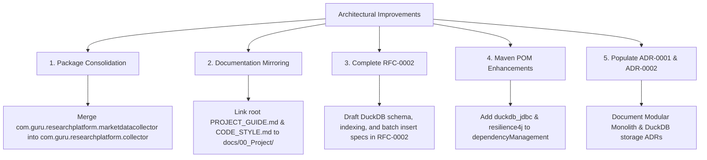

# Comprehensive Architecture Review: Research Platform

**Author:** Senior Software Engineer  
**Date:** August 2026  
**Repository:** `research-platform`  
**Target File Reviewed:** [PROJECT_UNDERSTANDING.md](file:///c:/Guru/projects/research-platform/PROJECT_UNDERSTANDING.md)  
**Build Status:** Clean (`.\mvnw.cmd test` passing across all 5 reactor modules)  

---

## Executive Overview

This document presents a comprehensive technical review of the architecture, package structures, naming conventions, module boundaries, dependencies, documentation health, scalability posture, and future compatibility of the **Research Platform**.

The repository is structured as a Maven multi-module **Modular Monolith** using Java 21 and Spring Boot 3.5.x. Overall, the architectural vision is well-conceived, enforcing strict separation of concerns, generic domain modeling (asset/exchange agnostic), and documentation-first development. 

However, critical discrepancies exist between architectural documentation and actual repository state, including dual package paths in `market-data-collector`, empty root documentation placeholders, missing library dependencies in `pom.xml`, and unwritten RFCs/ADRs required for imminent implementation phases.

---

## 1. Architectural Style & Layering Review

### Strengths
* **Modular Monolith Pattern:** Highly appropriate choice for the platform's current lifecycle stage (`0.1.0-SNAPSHOT`). It provides clean domain boundaries and strong compile-time encapsulation without the operational complexity of distributed microservices.
* **Strict Layering Rules:** Enforces 4 logical layers within each module:
  $$\text{Presentation} \longrightarrow \text{Application} \longrightarrow \text{Domain} \longrightarrow \text{Infrastructure}$$
* **Linear Data Flow:** Defines a clean, single-direction data pipeline:
  $$\text{Exchange API} \rightarrow \text{Collector} \rightarrow \text{Validation} \rightarrow \text{Normalization} \rightarrow \text{Persistence} \rightarrow \text{Indicators} \rightarrow \text{Patterns} \rightarrow \text{Strategy} \rightarrow \text{Backtest} \rightarrow \text{Analytics} \rightarrow \text{REST API} \rightarrow \text{React UI}$$
* **Constructor Injection & Immutability:** Mandates constructor-based dependency injection, forbids field injection (`@Autowired`), and utilizes immutable DTO records (`DownloadRequest`, `DownloadResult`).

### Architectural Concerns & Gaps
* **Domain Model Isolation in `market-data` vs `common`:** `DownloadRequest` and `DownloadResult` currently live in `common.dto`. While appropriate for cross-module DTOs, the domain entities for `Candle`, `Asset`, and `Exchange` are slated for `market-data` which currently has empty package folders. Domain models must remain standard Java objects independent of Spring Boot or database annotations.

---

## 2. Package & Directory Structure Review

### Critical Issues Identified

1. **Dual Package Collision in `market-data-collector`:**
   * Found two divergent package hierarchies in the same module:
     * `com.guru.researchplatform.marketdatacollector.provider` (Contains `MarketDataProvider` and `BinanceMarketDataProvider`)
     * `com.guru.researchplatform.collector.*` (Contains empty subdirectories: `client`, `configuration`, `mapper`, `provider/binance`, `service`, `validation`)
   * **Impact:** High risk of circular imports, developer confusion, and violation of [PackageStructure.md](file:///c:/Guru/projects/research-platform/docs/01_Architecture/PackageStructure.md).

2. **Empty Placeholder Package Directories:**
   * `application`: `candle`, `configuration`, `marketdata` directories exist as empty folders.
   * `market-data`: `domain`, `entity`, `repository`, `service` exist as empty folders.
   * `common`: `constant`, `exception`, `port` exist as empty folders.
   * **Impact:** Empty directories add noise and dilute Git history without delivering code contracts.

3. **Package Naming Deviation:**
   * Package structure docs prescribe `com.guru.researchplatform.<module_name>.<layer>` (e.g. `com.guru.researchplatform.collector.provider`).
   * Current code uses `marketdatacollector` (concatenated without delimiters) in one path and `collector` in another.

---

## 3. Naming Conventions Review

### Observations & Alignment
* **Java Types & Records:** `DownloadRequest`, `DownloadResult`, `MarketDataProvider`, and `BinanceMarketDataProvider` strictly adhere to `PascalCase` and clear interface naming (no `IMarketDataProvider` prefix, following clean code guidelines).
* **Enums:** `Exchange` (`BINANCE`, `BYBIT`, `COINBASE`, etc.), `Timeframe` (`ONE_MINUTE`, `ONE_HOUR`, `ONE_DAY`), and `DownloadStatus` (`SUCCESS`, `FAILED`, `PARTIAL_SUCCESS`) follow standard `UPPER_SNAKE_CASE`.
* **File Naming Inconsistency in Root:**
  * Root file `roadmap.md` is lowercase.
  * Document in `docs/00_Project/Roadmap.md` is PascalCase.
  * Root files `PROJECT_GUIDE.md`, `CODE_STYLE.md`, `DECISIONS.md`, `CONTRIBUTING.md` are uppercase.
  * Standardizing file casing across the project root is recommended.

---

## 4. Module Boundaries & Responsibilities

### Existing Modules (`pom.xml`)
* `common`: Shared DTOs, Enums, Exceptions, and Ports. Zero dependencies on other project modules. Excellent isolation.
* `application`: Spring Boot application entry point and REST endpoints. Correctly depends on `market-data-collector`, `market-data`, and `common`.
* `market-data`: Owns domain models and repository abstractions. Depends on `common`.
* `market-data-collector`: Handles data ingestion, exchange providers, validation, and persistence. Depends on `market-data` and `common`.

### Evaluation against Single Responsibility Principle (SRP)
The separation of responsibilities between `market-data` (domain concepts) and `market-data-collector` (data download & ingestion orchestrator) is architecturally sound. Future planned modules (`indicator-engine`, `pattern-engine`, `strategy-engine`, `backtest-engine`, `analytics-engine`) maintain high cohesion and clear isolation boundaries.

---

## 5. Dependency Management & Build Setup

### Maven `pom.xml` Inspection
* **Java Version:** 21 (`<java.version>21</java.version>`).
* **Spring Boot:** 3.5.0 via `spring-boot-dependencies` BOM.
* **JUnit:** Jupiter 5.12.2.
* **Lombok:** 1.18.36.

### Missing Essential Dependencies for Imminent Phase
To complete Phase 3 (Binance HTTP Download), Phase 4 (Validation), and Phase 5 (DuckDB Storage) of RFC-0001, the following dependencies are currently **missing** from `pom.xml`:

1. **DuckDB JDBC Driver:** `org.duckdb:duckdb_jdbc` (required for local analytical candle persistence).
2. **Spring Web / HTTP Client:** `org.springframework.boot:spring-boot-starter-web` is declared in `application/pom.xml`, but `market-data-collector` has no HTTP client library (Spring 6 `RestClient` or `WebClient`) declared.
3. **Resilience & Rate Limiting:** `io.github.resilience4j:resilience4j-retry` or `resilience4j-ratelimiter` for handling exchange API throttling and exponential backoff as specified in RFC-0001 §16-17.
4. **Jackson Time Module:** For parsing ISO-8601 timestamps and exchange JSON responses cleanly into Java `Instant` types.

---

## 6. Documentation-First Integrity

### The Root Documentation Gap
A major discrepancy exists between the root directory documentation and the `docs/` folder:

| File Location | Line Count / State | Issues Identified |
| :--- | :--- | :--- |
| `README.md` (Root) | 34 lines | Basic module table and build instructions |
| `PROJECT_GUIDE.md` (Root) | 2 lines | Empty placeholder |
| `docs/00_Project/ProjectGuide.md` | 544 lines | Master documentation specification |
| `CONTRIBUTING.md` (Root) | 2 lines | Empty placeholder |
| `CODE_STYLE.md` (Root) | 2 lines | Empty placeholder |
| `DECISIONS.md` (Root) | 2 lines | Empty placeholder |
| `roadmap.md` (Root) | 0 lines | Empty placeholder |

* **Risk:** Developers or AI assistants inspecting root files will conclude that project guidelines and coding standards are undefined, despite a detailed 544-line specification residing in `docs/00_Project/ProjectGuide.md`.

### Status of RFCs and ADRs
* **Accepted RFCs:** Only `RFC-0001-Market-Data-Collector.md` is complete (617 lines).
* **Draft/Placeholder RFCs:** `RFC-0002` (DuckDB), `RFC-0003` (Indicators), `RFC-0004` (Patterns), `RFC-0005` (Strategy), `RFC-0006` (Backtest) are 2-line placeholder files.
* **ADRs:** `ADR-0001.md`, `ADR-0002.md`, `ADR-0003.md` are empty 2-line files.
* **Violation of Methodology:** RFC-0001 Phase 5 relies on DuckDB persistence, but RFC-0002 is unwritten. Implementing code before completing RFC-0002 violates the project's **Documentation-First Development** rule.

---

## 7. Scalability Analysis

### Analytical Storage Scalability (DuckDB)
* DuckDB is an embedded columnar OLAP database, making it exceptionally fast for analytical aggregations (vectorized execution, columnar compression, high-speed candle reads for backtesting).
* **Bottleneck Risk:** Because DuckDB is an in-process database, concurrent write access from multiple worker threads or application instances is restricted. For high-volume multi-symbol historical downloading, writes must be batched using single-writer queues or bulk Parquet imports.

### Ingestion & Memory Scalability
* Historical downloads for multi-year 1-minute candle datasets (e.g. 500,000+ candles per pair/year) must avoid loading full datasets into Java heap memory simultaneously.
* Market Data Collector must implement chunked streaming downloads (e.g. downloading 1,000 candles per API batch, streaming directly into validation and DuckDB bulk inserts).

---

## 8. Future Compatibility & Migration Path

### Microservices Readyness
* The current Maven multi-module isolation ensures that if `market-data-collector` or `backtest-engine` eventually needs to scale out independently, they can be extracted into standalone Spring Boot microservices by replacing internal Java service calls with gRPC/REST clients or message queues (Kafka/RabbitMQ) without refactoring core domain logic.

### Multi-Exchange Extensibility
* The `MarketDataProvider` interface design is clean and extensible:
```java
public interface MarketDataProvider {
    DownloadResult downloadHistoricalCandles(DownloadRequest request);
}
```
* Adding future providers (`CoinbaseMarketDataProvider`, `BybitMarketDataProvider`, `KrakenMarketDataProvider`) requires creating new provider implementations under `market-data-collector` without altering existing modules or public contracts (satisfying the Open/Closed Principle).

---

## 9. Key Recommended Improvements

The following architectural and structural improvements should be executed before writing feature implementation code:



### Recommendation Details

1. **Consolidate Package Structure in `market-data-collector`:**
   * Standardize the package path to `com.guru.researchplatform.collector.*` (or `com.guru.researchplatform.marketdatacollector.*` consistently). Remove duplicate empty package branches.
2. **Synchronize Root Documentation:**
   * Update root files (`PROJECT_GUIDE.md`, `CODE_STYLE.md`, `DECISIONS.md`, `ROADMAP.md`) to either contain the full documentation or explicitly reference `docs/00_Project/ProjectGuide.md`.
3. **Elaborate `RFC-0002-DuckDB-Persistence.md`:**
   * Write the technical specification for DuckDB schema design, candle table partitioning, JDBC connection pool settings, and bulk insert strategy prior to implementing Phase 5 of RFC-0001.
4. **Update Parent `pom.xml` Dependency Management:**
   * Add `duckdb_jdbc` and `resilience4j` versions to `<dependencyManagement>` in the root `pom.xml` to ensure version consistency across modules when implementations begin.
5. **Populate Key Architectural Decision Records (ADRs):**
   * Fill out `ADR-0001` (Choice of Modular Monolith), `ADR-0002` (Choice of DuckDB for Local OLAP Persistence), and `ADR-0003` (Choice of REST Client & Resilience strategy).

---

## Summary Matrix

| Review Dimension | Status | Key Action Item |
| :--- | :--- | :--- |
| **Architecture** | Excellent | Preserve strict 4-layer isolation and linear data flow |
| **Packages** | Needs Attention | Consolidate duplicate package paths in `market-data-collector` |
| **Naming** | Good | Fix root `roadmap.md` casing and align package naming |
| **Modules** | Excellent | Maintain SRP across current and future Maven modules |
| **Dependencies** | Needs Attention | Add DuckDB JDBC and Resilience4j to parent `pom.xml` |
| **Documentation** | Needs Attention | Populate root meta-files and draft `RFC-0002` |
| **Scalability** | Good | Implement chunked batching for DuckDB candle ingestion |
| **Future Compatibility** | Excellent | Modular monolith cleanly supports future microservices migration |
