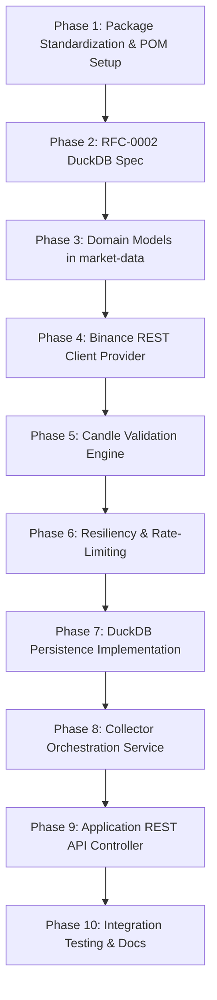

# Sprint 2 Implementation Plan: Research Platform

**Author:** Senior Software Engineer  
**Date:** August 2026  
**Repository:** `research-platform`  
**Baseline Review:** [PROJECT_UNDERSTANDING.md](file:///c:/Guru/projects/research-platform/PROJECT_UNDERSTANDING.md) | [ARCHITECTURE_REVIEW.md](file:///c:/Guru/projects/research-platform/ARCHITECTURE_REVIEW.md) | [RFC-0001](file:///c:/Guru/projects/research-platform/RFC/RFC-0001-Market-Data-Collector.md)  
**Goal:** Deliver the complete, end-to-end historical market data collection, validation, and local DuckDB persistence pipeline for Binance historical klines without implementing trading logic.

---

## Sprint 2 Breakdown & Phasing Overview

Sprint 2 transitions the platform from stubbed public contracts (`0.1.0-SNAPSHOT`) to a fully functional historical candle ingestion engine. To satisfy the project's **Documentation-First** methodology and strict **Modular Monolith Layering**, Sprint 2 is broken down into 10 small, independent, and sequential phases:

---

## Phase 1: Package Standardization & Parent POM Setup

### Objective
Resolve the package directory conflict in `market-data-collector` by consolidating all classes under `com.guru.researchplatform.collector.*` and update `pom.xml` dependency management with required libraries (DuckDB JDBC, Resilience4j, Spring Web).

### Files
* [pom.xml](file:///c:/Guru/projects/research-platform/pom.xml)
* [market-data-collector/pom.xml](file:///c:/Guru/projects/research-platform/market-data-collector/pom.xml)
* [MarketDataProvider.java](file:///c:/Guru/projects/research-platform/market-data-collector/src/main/java/com/guru/researchplatform/collector/provider/MarketDataProvider.java)
* [BinanceMarketDataProvider.java](file:///c:/Guru/projects/research-platform/market-data-collector/src/main/java/com/guru/researchplatform/collector/provider/BinanceMarketDataProvider.java)
* [BinanceMarketDataProviderTest.java](file:///c:/Guru/projects/research-platform/market-data-collector/src/test/java/com/guru/researchplatform/collector/provider/BinanceMarketDataProviderTest.java)

### Classes / Packages
* Package relocation: Move from `com.guru.researchplatform.marketdatacollector.provider` to `com.guru.researchplatform.collector.provider`.
* Remove redundant `com/guru/researchplatform/marketdatacollector` package directory tree.

### Tests
* Update [BinanceMarketDataProviderTest.java](file:///c:/Guru/projects/research-platform/market-data-collector/src/test/java/com/guru/researchplatform/collector/provider/BinanceMarketDataProviderTest.java) imports to reflect package consolidation.
* Run `.\mvnw.cmd clean test` across the reactor.

### Risks
* Package migration could temporarily break existing imports if references are missed.

### Acceptance Criteria
* `.\mvnw.cmd test` compiles cleanly across all reactor modules.
* No duplicate package branches exist in `market-data-collector`.
* DuckDB JDBC (`org.duckdb:duckdb_jdbc:1.1.3`) and Resilience4j are declared in root `<dependencyManagement>`.

---

## Phase 2: RFC-0002 (DuckDB Persistence Specification)

### Objective
Write and finalize [RFC-0002-DuckDB-Persistence.md](file:///c:/Guru/projects/research-platform/RFC/RFC-0002-DuckDB-Persistence.md) detailing schema design, candle table partitioning, primary keys, index strategies, JDBC connection pooling, and bulk insertion logic prior to code implementation.

### Files
* [RFC-0002-DuckDB-Persistence.md](file:///c:/Guru/projects/research-platform/RFC/RFC-0002-DuckDB-Persistence.md)
* [ADR-0002.md](file:///c:/Guru/projects/research-platform/docs/02_ADR/ADR-0002.md)

### Classes
* Specifications for SQL DDL schemas, `CandleEntity`, `DuckDBConnectionProvider`, and `CandleRepository`.

### Tests
* Documentation review check: Verify RFC-0002 covers table schema `candles(exchange, symbol, timeframe, open_time, open, high, low, close, volume, close_time)`, composite primary keys, and transaction handling.

### Risks
* Incomplete schema design could require database migration logic later.

### Acceptance Criteria
* [RFC-0002-DuckDB-Persistence.md](file:///c:/Guru/projects/research-platform/RFC/RFC-0002-DuckDB-Persistence.md) status marked as `Accepted`.
* [ADR-0002.md](file:///c:/Guru/projects/research-platform/docs/02_ADR/ADR-0002.md) updated with rationale for selecting DuckDB as local OLAP engine.

---

## Phase 3: Domain Models & Candle Entities (`market-data` Module)

### Objective
Define core, framework-independent domain models (`Candle`, `Asset`, `ExchangeSymbol`) in the `market-data` module to serve as the single source of truth for financial candle representations.

### Files
* `market-data/src/main/java/com/guru/researchplatform/marketdata/model/Candle.java`
* `market-data/src/main/java/com/guru/researchplatform/marketdata/model/Asset.java`
* `market-data/src/main/java/com/guru/researchplatform/marketdata/repository/CandleRepositoryPort.java`

### Classes
* `Candle` (Java Record: `Instant openTime`, `BigDecimal open`, `BigDecimal high`, `BigDecimal low`, `BigDecimal close`, `BigDecimal volume`, `Instant closeTime`, `long quoteVolume`, `long tradesCount`).
* `Asset` (Record: `String symbol`, `String baseAsset`, `String quoteAsset`).
* `CandleRepositoryPort` (Interface: `void saveAll(Exchange exchange, String symbol, Timeframe timeframe, List<Candle> candles)`, `List<Candle> findCandles(...)`).

### Tests
* `CandleTest.java`: Verify record immutability, range validation (high >= low, volume >= 0), and equality checks.

### Risks
* Using primitive double instead of `BigDecimal` for financial numbers could introduce floating point precision errors.

### Acceptance Criteria
* All domain objects in `market-data` are immutable Java Records using `BigDecimal` for prices and `Instant` for timestamps.
* Zero Spring or database annotations present in domain classes.

---

## Phase 4: Binance REST API Client Integration (`market-data-collector` Module)

### Objective
Implement the Binance historical kline REST client provider using Spring 6 `RestClient` to fetch historical candles from `https://api.binance.com/api/v3/klines`.

### Files
* `market-data-collector/src/main/java/com/guru/researchplatform/collector/client/BinanceRestClient.java`
* `market-data-collector/src/main/java/com/guru/researchplatform/collector/provider/binance/BinanceMarketDataProvider.java`
* `market-data-collector/src/main/java/com/guru/researchplatform/collector/mapper/BinanceCandleMapper.java`

### Classes
* `BinanceRestClient`: Executes HTTP GET requests to `/api/v3/klines` with query parameters (`symbol`, `interval`, `startTime`, `endTime`, `limit=1000`).
* `BinanceCandleMapper`: Maps raw Binance JSON arrays `[openTime, open, high, low, close, volume, closeTime, ...]` into `Candle` domain models.
* `BinanceMarketDataProvider`: Concrete implementation of `MarketDataProvider` orchestrating API pagination.

### Tests
* `BinanceCandleMapperTest.java`: Unit tests mapping mock Binance JSON responses to `Candle` domain models.
* `BinanceRestClientTest.java`: MockRestServiceServer test verifying HTTP URL encoding, parameters, and 200 OK responses.

### Risks
* Binance API rate limits (1200 request weight/min) or HTTP 429 response handling failures during large date range fetches.

### Acceptance Criteria
* `BinanceMarketDataProvider` correctly requests and paginates raw historical kline arrays from Binance API up to 1,000 candles per batch.

---

## Phase 5: Download Validation Engine (`market-data-collector` Module)

### Objective
Build the data validation pipeline to detect missing timestamps, gaps, OHLC price anomalies, negative volumes, and duplicate candles before persistence.

### Files
* `market-data-collector/src/main/java/com/guru/researchplatform/collector/validation/CandleValidator.java`
* `market-data-collector/src/main/java/com/guru/researchplatform/collector/validation/ValidationResult.java`
* `market-data-collector/src/main/java/com/guru/researchplatform/collector/exception/ValidationException.java`

### Classes
* `CandleValidator`: Validates a list of candles against compliance rules:
  1. `high >= open`, `high >= low`, `high >= close`, `low <= open`, `low <= close`.
  2. `volume >= 0`.
  3. Strict chronological timestamp sorting (`t[n] > t[n-1]`).
  4. Duplicate timestamp filtering.
* `ValidationResult` (Record: `boolean valid`, `List<Candle> validCandles`, `List<String> errors`, `long duplicatesFound`).

### Tests
* `CandleValidatorTest.java`: Comprehensive tests for invalid high/low, out-of-order timestamps, duplicate timestamps, and zero/negative volume.

### Risks
* Strict validation dropping valid candles due to minor exchange anomalies.

### Acceptance Criteria
* Validator successfully filters duplicate candles and flags invalid price candles.
* Returns structured `ValidationResult` summary without crashing the batch.

---

## Phase 6: Rate Limiting & Retry Resiliency Infrastructure

### Objective
Integrate exponential backoff retry and rate-limiting middleware to protect historical downloads against HTTP 429/5xx transient failures.

### Files
* `market-data-collector/src/main/java/com/guru/researchplatform/collector/resilience/RateLimiterService.java`
* `market-data-collector/src/main/java/com/guru/researchplatform/collector/resilience/RetryInterceptor.java`

### Classes
* `RateLimiterService`: Tracks API request weights and automatically sleeps thread if request threshold is reached.
* `RetryInterceptor`: Implements 3-tier exponential backoff retries (e.g. 1s, 2s, 4s) on HTTP 429 / 5xx responses using Resilience4j.

### Tests
* `RetryInterceptorTest.java`: Simulates HTTP 503 service unavailable followed by 200 OK to verify retry execution.
* `RateLimiterServiceTest.java`: Verifies request throttling when capacity is exhausted.

### Risks
* Incorrect retry logic resulting in infinite request loops or blocking worker threads.

### Acceptance Criteria
* Automatic retry succeeds on transient 5xx errors (max 3 retries).
* Respects HTTP 429 `Retry-After` header when throttled by exchange.

---

## Phase 7: DuckDB Candle Persistence Layer (`market-data-collector` / `market-data` Modules)

### Objective
Implement the DuckDB JDBC repository for persistent, local columnar storage of historical candles as specified in RFC-0002.

### Files
* `market-data-collector/src/main/java/com/guru/researchplatform/collector/repository/DuckDBCandleRepository.java`
* `market-data-collector/src/main/java/com/guru/researchplatform/collector/configuration/DuckDBConfiguration.java`

### Classes
* `DuckDBConfiguration`: Configures Spring DataSource / JDBC Connection Pool for DuckDB file-based storage (`jdbc:duckdb:datasets/market_data.duckdb`).
* `DuckDBCandleRepository`: Implements `CandleRepositoryPort` using JDBC `PreparedStatement` batch inserts (`INSERT INTO candles VALUES (?, ?, ...) ON CONFLICT DO NOTHING`).

### Tests
* `DuckDBCandleRepositoryTest.java`: Embedded DuckDB integration test verifying table creation, bulk batch insertion, duplicate key suppression, and querying by symbol/timeframe range.

### Risks
* DuckDB file lock conflicts if multiple application threads attempt simultaneous uncoordinated writes.

### Acceptance Criteria
* Candles persisted into embedded DuckDB instance cleanly.
* Primary key constraint `(exchange, symbol, timeframe, open_time)` prevents duplicate rows.

---

## Phase 8: Collector Orchestration Service (`market-data-collector` Module)

### Objective
Implement `MarketDataCollectorService` to orchestrate the end-to-end download flow (Request -> Download -> Validate -> Normalize -> Persist -> Summary Report).

### Files
* `market-data-collector/src/main/java/com/guru/researchplatform/collector/service/MarketDataCollectorService.java`
* `market-data-collector/src/main/java/com/guru/researchplatform/collector/service/HistoricalDownloadOrchestrator.java`

### Classes
* `HistoricalDownloadOrchestrator`: Entry service method `DownloadResult download(DownloadRequest request)` that coordinates provider lookup, chunked pagination loop, validation, and DuckDB storage.

### Tests
* `HistoricalDownloadOrchestratorTest.java`: Unit test with mock `MarketDataProvider` and mock `CandleRepositoryPort` verifying full flow and return of `DownloadResult` statistics.

### Risks
* Partial download failure leaving database in an inconsistent time range.

### Acceptance Criteria
* Orchestrator returns complete `DownloadResult` (downloaded count, duplicates count, duration, warnings).
* Resumes interrupted downloads by querying DuckDB max existing timestamp.

---

## Phase 9: Application REST API Controller (`application` Module)

### Objective
Expose REST HTTP POST endpoint `/api/v1/market-data/download` in the `application` module to allow external clients/UI to trigger historical candle downloads.

### Files
* `application/src/main/java/com/guru/researchplatform/application/controller/MarketDataController.java`
* `application/src/main/java/com/guru/researchplatform/application/dto/DownloadApiRequest.java`

### Classes
* `MarketDataController`: `@RestController` at `/api/v1/market-data`. Exposes `@PostMapping("/download") ResponseEntity<DownloadResult> triggerDownload(@RequestBody DownloadApiRequest request)`.
* `DownloadApiRequest`: API DTO for incoming JSON paylod (`exchange`, `symbol`, `timeframe`, `startTime`, `endTime`).

### Tests
* `MarketDataControllerTest.java`: `@WebMvcTest` verifying HTTP POST status 200 OK, input validation errors (400 Bad Request), and JSON response formatting.

### Risks
* Exposing long-running downloads synchronously over HTTP could cause client timeouts for large ranges.

### Acceptance Criteria
* `POST /api/v1/market-data/download` triggers download service and returns `200 OK` with JSON `DownloadResult`.

---

## Phase 10: End-to-End Integration Testing & Documentation Finalization

### Objective
Execute full end-to-end integration tests using an isolated DuckDB test database and update project documentation (`CHANGELOG.md`, module READMEs) to satisfy the Definition of Done.

### Files
* `application/src/test/java/com/guru/researchplatform/application/MarketDataIntegrationTest.java`
* `docs/03_Modules/MarketDataCollector/README.md`
* [CHANGELOG.md](file:///c:/Guru/projects/research-platform/CHANGELOG.md)

### Classes / Tests
* `MarketDataIntegrationTest`: End-to-end Spring Boot integration test testing `/api/v1/market-data/download` with a mock server, validating DuckDB database state after execution.

### Risks
* Test failures due to external network dependency (mitigated by using `MockRestServiceServer`).

### Acceptance Criteria
* `.\mvnw.cmd test` passes 100% across all reactor modules.
* Module `docs/03_Modules/MarketDataCollector/README.md` updated with API specifications.
* [CHANGELOG.md](file:///c:/Guru/projects/research-platform/CHANGELOG.md) updated with Sprint 2 feature summary.
